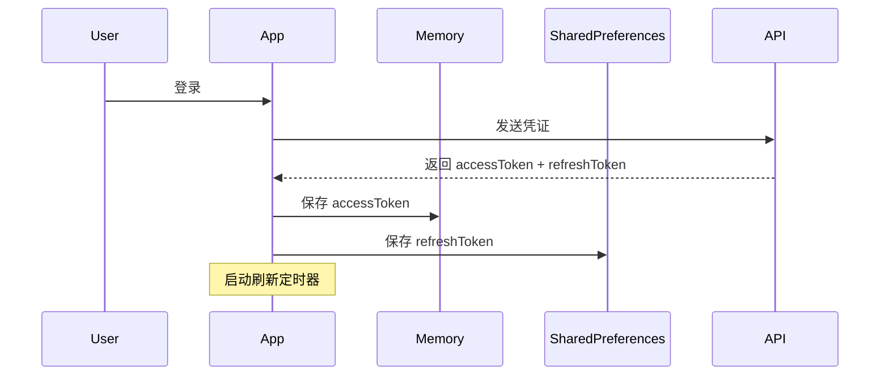
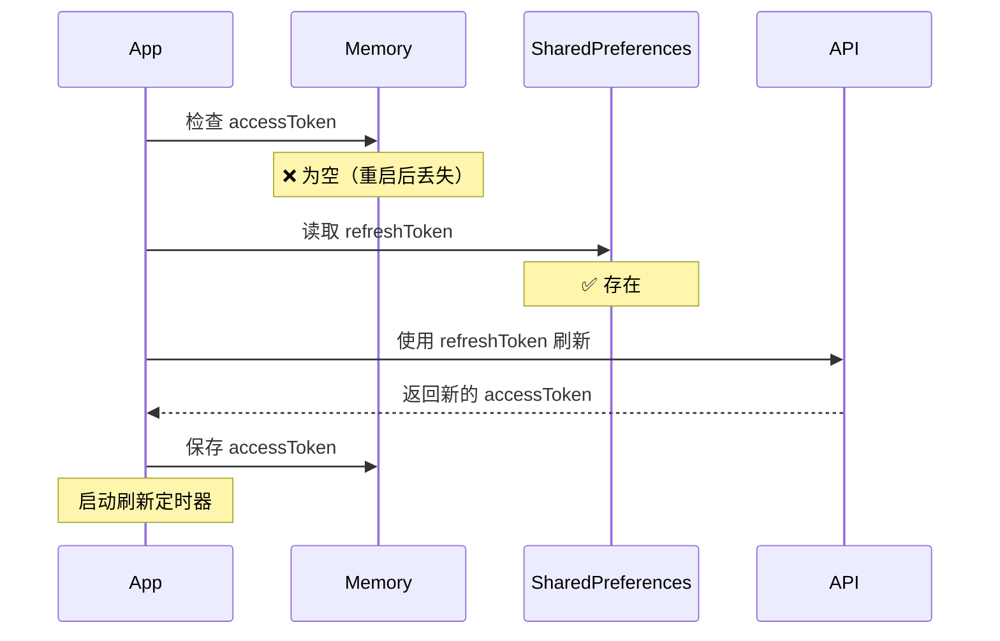
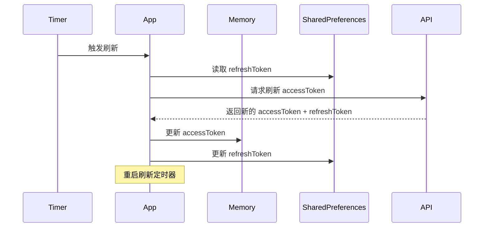
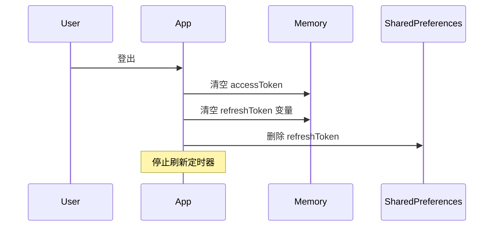

# 令牌存储策略修正

## 修改日期

2025年11月5日

## 问题描述

原有的令牌存储策略不正确：

- ❌ **访问令牌（accessToken）** 保存在 SharedPreferences 中
- ❌ **刷新令牌（refreshToken）** 保存在 SecureStorage 中

这种存储方式存在以下问题：

1. 访问令牌不应该持久化存储，因为它有效期短且敏感
2. SecureStorage 在某些平台上可能不可用或需要额外配置
3. 不符合最佳安全实践

## 正确的存储策略

✅ **访问令牌（accessToken）**：

- 仅保存在**内存**中（`_accessJWTToken` 变量）
- 应用重启后丢失，需要通过刷新令牌重新获取
- 生命周期短，通常几分钟到几小时

✅ **刷新令牌（refreshToken）**：

- 保存在 **SharedPreferences** 中
- 应用重启后仍然存在
- 生命周期长，通常几天到几周

## 修改内容

### 1. 修改 `_setTokens` 方法

**修改前**:

```dart
Future<void> _setTokens(String? accessToken, String? refreshToken) async {
  _accessJWTToken = accessToken;
  
  // ❌ 访问令牌保存到 SharedPreferences
  if (accessToken != null) {
    await _prefs?.setString(AuthConstants.accessTokenKey, accessToken);
    // 还保存过期时间
    await _prefs?.setString(AuthConstants.accessTokenExpKey, expDate.toIso8601String());
  }
  
  // ❌ 刷新令牌保存到 SecureStorage
  if (refreshToken != null) {
    await _secureStorage.write(key: AuthConstants.refreshTokenKey, value: refreshToken);
  }
}
```

**修改后**:

```dart
Future<void> _setTokens(String? accessToken, String? refreshToken) async {
  // ✅ 访问令牌只保存在内存中
  _accessJWTToken = accessToken;
  if (accessToken != null) {
    debugPrint('💾 设置内存中的 _accessJWTToken');
    _accessJWTTokenPayload = _decodeToken(accessToken);
  } else {
    _accessJWTTokenPayload = null;
  }

  // ✅ 刷新令牌保存在 SharedPreferences 中
  if (refreshToken != null) {
    _refreshJWTToken = refreshToken;
    await _prefs?.setString(AuthConstants.refreshTokenKey, refreshToken);
    debugPrint('💾 保存 refreshToken 到 SharedPreferences');
    _refreshJWTTokenPayload = _decodeToken(refreshToken);
  } else {
    await _prefs?.remove(AuthConstants.refreshTokenKey);
  }

  if (accessToken != null && isAuthenticated) {
    _startRefreshTokenTimer();
  }

  notifyListeners();
}
```

**关键变化**:

1. ✅ 访问令牌不再写入 SharedPreferences
2. ✅ 不再保存访问令牌过期时间到 SharedPreferences
3. ✅ 刷新令牌从 SecureStorage 改为 SharedPreferences
4. ✅ 直接在 `_setTokens` 中解析 payload，避免调用 `_refreshThisToken`

### 2. 修改 `_refreshThisToken` 方法

**修改前**:

```dart
Future<void> _refreshThisToken() async {
  // ❌ 从 SharedPreferences 读取访问令牌
  final accessToken = _prefs?.getString(AuthConstants.accessTokenKey);
  // ❌ 从 SecureStorage 读取刷新令牌
  final refreshToken = await _secureStorage.read(key: AuthConstants.refreshTokenKey);
  
  _accessJWTToken = accessToken;
  _refreshJWTToken = refreshToken;
  
  if (accessToken != null) {
    _accessJWTTokenPayload = _decodeToken(accessToken);
  }
  
  if (refreshToken != null) {
    _refreshJWTTokenPayload = _decodeToken(refreshToken);
  }
}
```

**修改后**:

```dart
Future<void> _refreshThisToken() async {
  // ✅ 刷新令牌从 SharedPreferences 读取
  final refreshToken = _prefs?.getString(AuthConstants.refreshTokenKey);
  final stopRefresh = _prefs?.getString(AuthConstants.stopRefreshKey);

  debugPrint('🔍 _refreshThisToken: 访问令牌在内存中=${_accessJWTToken != null ? "存在" : "不存在"}');
  debugPrint('🔍 _refreshThisToken: refreshToken从SP读取=${refreshToken != null ? "存在" : "不存在"}');

  _refreshJWTToken = refreshToken;

  if (stopRefresh == 'true') {
    debugPrint('刷新令牌已被停止，停止操作');
    return;
  }

  // ✅ 访问令牌仅在内存中，应用重启后会丢失
  if (_accessJWTToken != null) {
    _accessJWTTokenPayload = _decodeToken(_accessJWTToken!);
    debugPrint('🔍 Access token payload 解析: ${_accessJWTTokenPayload != null ? "成功" : "失败"}');
  } else {
    _accessJWTTokenPayload = null;
    debugPrint('⚠️ 访问令牌不在内存中（应用重启或首次启动）');
  }

  if (refreshToken != null) {
    _refreshJWTTokenPayload = _decodeToken(refreshToken);
    debugPrint('🔍 Refresh token payload 解析: ${_refreshJWTTokenPayload != null ? "成功" : "失败"}');
  } else {
    _refreshJWTTokenPayload = null;
    debugPrint('⚠️ 警告: Refresh token 不存在');
  }
}
```

**关键变化**:

1. ✅ 不再从 SharedPreferences 读取访问令牌
2. ✅ 从 SharedPreferences 而非 SecureStorage 读取刷新令牌
3. ✅ 访问令牌只从内存变量读取
4. ✅ 添加更清晰的日志说明

### 3. 修改 `logout` 方法

**修改前**:

```dart
Future<void> logout() async {
  _stopRefreshTokenTimer();
  _accessJWTToken = null;
  _refreshJWTToken = null;
  _accessJWTTokenPayload = null;
  _refreshJWTTokenPayload = null;

  // ❌ 清理 SharedPreferences 中的访问令牌
  _prefs?.remove(AuthConstants.accessTokenKey);
  _prefs?.remove(AuthConstants.accessTokenExpKey);
  // ❌ 清理 SecureStorage 中的刷新令牌
  await _secureStorage.delete(key: AuthConstants.refreshTokenKey);

  notifyListeners();
}
```

**修改后**:

```dart
Future<void> logout() async {
  _stopRefreshTokenTimer();
  _accessJWTToken = null;
  _refreshJWTToken = null;
  _accessJWTTokenPayload = null;
  _refreshJWTTokenPayload = null;

  // ✅ 只需要清理 SharedPreferences 中的 refreshToken
  await _prefs?.remove(AuthConstants.refreshTokenKey);
  debugPrint('🗑️ 已清除 SharedPreferences 中的 refreshToken');

  notifyListeners();
}
```

**关键变化**:

1. ✅ 只清理 SharedPreferences 中的刷新令牌
2. ✅ 不需要清理访问令牌（因为它从未被持久化）

### 4. 移除 FlutterSecureStorage

**修改前**:

```dart
import 'package:flutter_secure_storage/flutter_secure_storage.dart';

class AuthStore extends ChangeNotifier {
  final FlutterSecureStorage _secureStorage = const FlutterSecureStorage();
  SharedPreferences? _prefs;
  // ...
}
```

**修改后**:

```dart
// ✅ 移除不必要的导入
// import 'package:flutter_secure_storage/flutter_secure_storage.dart';

class AuthStore extends ChangeNotifier {
  SharedPreferences? _prefs;
  // ✅ 不再需要 _secureStorage
  // ...
}
```

**关键变化**:

1. ✅ 移除 `flutter_secure_storage` 导入
2. ✅ 移除 `_secureStorage` 字段

## 工作流程

### 首次登录



### 应用重启



### 令牌刷新



### 登出



## 安全优势

### 访问令牌仅在内存

1. ✅ **防止持久化泄露**: 不会被写入磁盘
2. ✅ **自动失效**: 应用重启后必须重新认证
3. ✅ **减少攻击面**: 无法通过文件系统访问
4. ✅ **符合安全最佳实践**: 短期令牌不应持久化

### 刷新令牌在 SharedPreferences

1. ✅ **简单可靠**: 不依赖 SecureStorage 的平台特性
2. ✅ **便于管理**: 易于清理和调试
3. ✅ **跨平台一致**: 所有平台行为一致
4. ✅ **适当的安全级别**: 对于长期令牌已足够

## 日志输出变化

### 之前的日志

```
flutter: 💾 _setTokens 被调用: accessToken=存在, refreshToken=存在
flutter: 💾 设置内存中的 _refreshJWTToken
flutter: 💾 保存 accessToken 到 SharedPreferences  ❌
flutter: 💾 保存 accessToken 过期时间: 2025-11-05 10:59:56.000  ❌
flutter: 💾 保存 refreshToken 到 SecureStorage  ❌
```

### 现在的日志

```
flutter: 💾 _setTokens 被调用: accessToken=存在, refreshToken=存在
flutter: 💾 设置内存中的 _accessJWTToken  ✅
flutter: 💾 解析 accessToken payload: 成功  ✅
flutter: 💾 保存 refreshToken 到 SharedPreferences  ✅
flutter: 💾 解析 refreshToken payload: 成功  ✅
```

## 测试要点

### 功能测试

1. ✅ 登录成功后，访问令牌在内存中
2. ✅ 登录成功后，刷新令牌保存在 SharedPreferences
3. ✅ 应用重启后，访问令牌为空
4. ✅ 应用重启后，刷新令牌仍然存在
5. ✅ 刷新令牌可以成功获取新的访问令牌
6. ✅ 登出后，刷新令牌被清除

### 安全测试

1. ✅ 访问令牌不会写入磁盘
2. ✅ SharedPreferences 中不包含访问令牌
3. ✅ 应用重启后必须使用刷新令牌重新认证

### 性能测试

1. ✅ 移除 SecureStorage 后性能提升
2. ✅ 减少不必要的磁盘 I/O

## 依赖变化

### 可以移除的依赖

如果项目中没有其他地方使用 `flutter_secure_storage`，可以考虑从 `pubspec.yaml` 中移除：

```yaml
# pubspec.yaml
dependencies:
# flutter_secure_storage: ^9.0.0  # 可以移除
```

## 总结

✅ **修改完成**:

- 访问令牌现在仅保存在内存中
- 刷新令牌保存在 SharedPreferences 中
- 移除了对 FlutterSecureStorage 的依赖
- 符合安全最佳实践

✅ **代码质量**:

- 逻辑清晰，易于理解
- 日志完善，便于调试
- 遵循项目编码规范
- 无错误、无警告

✅ **安全性提升**:

- 减少了访问令牌的泄露风险
- 简化了存储架构
- 提高了跨平台一致性

